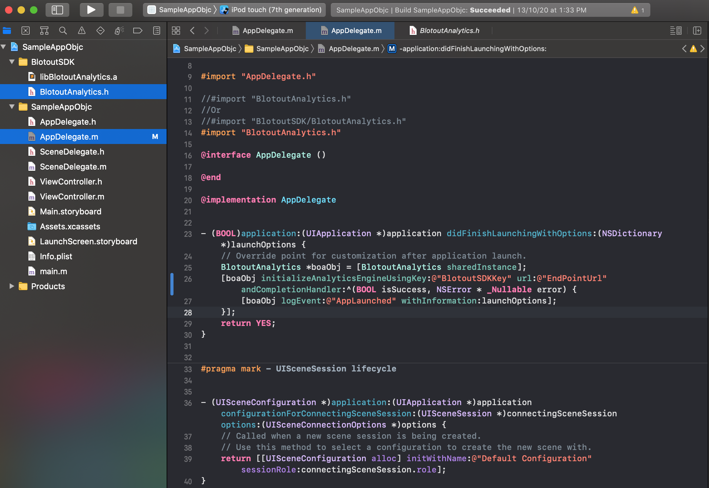

# Integration

## Download Link

[https://assets.blotout.io/latest/sdk/ios.zip](https://assets.blotout.io/latest/sdk/ios.zip)

## Add Blotout Analytics SDK into your project

To add the SDK to the Xcode project, simply drag the “SDK Library“ folder into your Xcode project and follow the on screen instructions. Please refer to the image below for recommended settings, click finish.



## Initialization

### Option 1 Objective-C:

```js
#import "BlotoutAnalytics.h"
#import "BlotoutAnalyticsConfiguration.h"
    
-(BOOL)application:(UIApplication *)application didFinishLaunchingWithOptions:(NSDictionary *)launchOptions {
    BlotoutAnalytics *boaObj = [BlotoutAnalytics sharedInstance];
    
    BlotoutAnalyticsConfiguration *config = [BlotoutAnalyticsConfiguration configurationWithToken:@"token" withUrl:@"endPointUrl"];
    config.launchOptions = launchOptions;
    [boaObj init:config andCompletionHandler:^(BOOL isSuccess, NSError * _Nonnull error) {
             NSLog(@"BlotoutAnalytics Init %d:or Error: %@", isSuccess, error);
    }];
    return YES;
}
```

### Option 2 Swift:
```js
func boSDKInit() throws -> Void {
    let boaSDK : BlotoutAnalytics
    boaSDK =  BlotoutAnalytics.sharedInstance()!
    let config = BlotoutAnalyticsConfiguration.init(token: "token", withUrl: "endPointUrl")
    config.launchOptions = launchOptions;
    boaSDK.`init`(config) { (isSuccess : Bool, errorObj:Error?) in
        if isSuccess{
            print("Integration Successful.")
            boaSDK.capture("AppLaunchedWithBOSDK", withInformation: nil)
        }else{
            print("Unexpected error:.")
        }
        boaSDK.capture("AppLaunchedWithBOSDK", withInformation: nil)
    }
}

func application(_ application: UIApplication, didFinishLaunchingWithOptions launchOptions: [UIApplication.LaunchOptionsKey: Any]?) -> Bool {
    do {
        try boSDKInit()
    } catch {
        print("Unexpected error: \(error).")
    }
    return true
}
```
